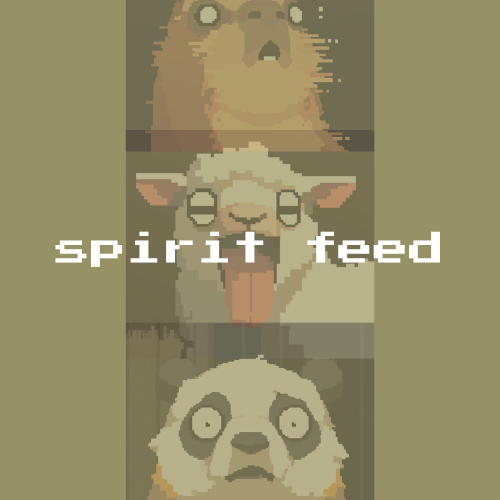

# spiritfeed



spiritfeed is a small, invite-only social app built for one specific friend group of 15-20 people. It does not need any public signup, or algorithm but just a feed, a spirit animal you pick once and keep for life, and a daily prompt that gives everyone a reason to show up.

Posts aren't permanent. Whatever you put up (you cannot put much anyways just pics and status) disappears from the feed 24 hours after you post it. The single best post of the day gets quietly archived before it goes; everything else is just gone. It's closer to a shared away-message board than a photo album.

> [!NOTE]
> Access is invite-only. Accounts are only created through a one-time link generated by the app owner AKA admin AKA me and there is no public sign-up flow, and there never will be. (Requests to join will be soon welcomed via email.)

## Features

| Feature | What it does |
| --- | --- |
| Feed | Photos and status posts from the group, newest first. Gone 24 hours after posting. |
| Spirit animals | Pick one at signup — permanent, and no two people share the same one. It's your avatar everywhere in the app. |
| Prompt of the day | One member is picked each day to set the prompt; everyone else answers it with a post before the window closes. |
| Streak & crown | Enough approval on your submission earns you a streak. Three days running and you hold the crown until someone takes it from you. |
| Reactions | A fixed set of five emoji. Tap to toggle, no comments and no reply threads for the moment. |
| Mentions | Tag a friend in a caption or status and it shows up as a real mention. |
| Push notifications | Today's prompt going live, your turn to set one, a reaction on your post, winning the crown. |
| Realtime feed | Open feeds update live over Supabase realtime hence no manual refresh. |
| Admin (me again) | The app owner can generate invite links and remove users. |

## Stack

Next.js (App Router) on Vercel, Supabase for Postgres, Auth, and Storage, installed as a PWA. Photos are compressed client-side before upload and served through short-lived signed URLs.

## Running it locally

```
git clone https://github.com/ashmitrrr/spiritfeed
cd spiritfeed
npm install
cp .env.example .env.local   # fill in your own Supabase project's keys
npm run dev
```

> [!NOTE]
> You'll need your own Supabase project as this isn't a shared backend. Apply the schema and set up a private `photos` storage bucket before posting will work.

## Using it for your own friend group

The code isn't tied to my group in any way that matters so nothing about the frontend has to change. If you want to run your own private spiritfeed for your own people instead of asking to join mine, you can. What "your own backend" actually involves, concretely:

- A Supabase project of your own (Postgres, Auth, Storage). There's no migration file or seed script committed here yet, so the schema has to be rebuilt by hand from `lib/database.types.ts` and the queries in the code — tables like `profiles`, `spirit_animals`, `invites`, `posts`, `reactions`, `statuses`, `daily_prompts`, `prompt_assignments`, `spirit_crown`, and a few more, plus RLS policies on each.
- The `spirit_animals` table seeded yourself, one row per animal key in `lib/spirit-animals.ts`. The pixel art already ships in `public/spirit-animals/`, so it's just the DB rows pointing at them.
- A private `photos` storage bucket.
- Your own `CRON_SECRET` and VAPID keypair (`npx web-push generate-vapid-keys`) for the 24h auto-delete job and push notifications.
- Something hitting `/api/cron/reap-posts` daily with that secret. That's Vercel Cron out of the box (see `vercel.json`) if you deploy there — anywhere else, you're wiring your own scheduler.

Once that's all up, open `/setup`. It's a one-time bootstrap route that only works while your `profiles` table is still empty so it makes whoever hits it first the admin, then locks itself shut for good. That's the whole "make your own admin account" step, and it's the intended way to stand up a fresh instance.

> [!NOTE]
> None of this is turnkey today. The missing piece is a committed schema, until there's a `supabase/migrations` folder or a single `schema.sql` in this repo, standing up your own instance means reading the code to figure out what to build, not running one command.

## Status

Built and maintained for one friend group. Not looking for more users, not accepting outside contributions right now.
